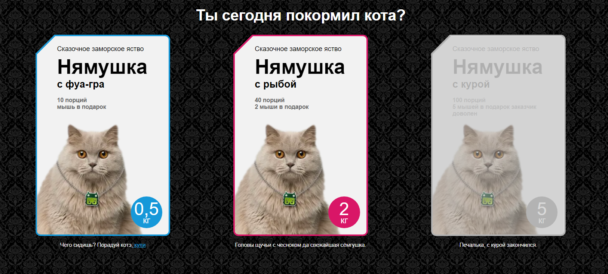
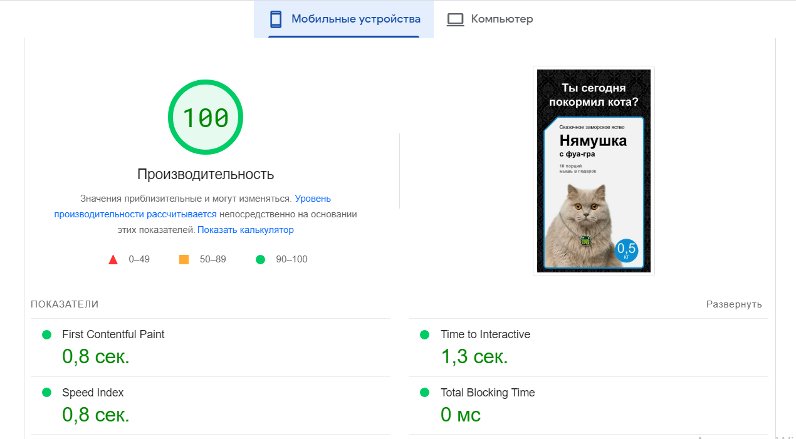

# Cats 

> Сайт для продажи кошачьего корма. 

https://cats-phi.vercel.app/

## Описание

При нажатии на карточку товара можно либо купить товар, либо отменить покупку. Товар, который закончился, будет серого цвета и недоступен для выбора. 

P/S/ ответы на вопросы лежат в файле answers.

## Скриншоты

## Команды

<table>
  <thead>
    <tr>
      <th>Команда</th>
      <th>Результат</th>
    </tr>
  </thead>
  <tbody>
    <tr>
      <td width="30%"><code>npm install</code></td>
      <td>Установить зависимости</td>
    </tr>
    <tr>
      <td><code>npm start</code></td>
      <td>Запустить приложение в режиме разработки.</td>
    </tr>
     <tr>
      <td><code>npm test</code></td>
      <td>Запуск тестов</td>
    </tr>
    <tr>
      <td><code>npm run build</code></td>
      <td>Собрать проект для продакшена</td>
    </tr>
  </tbody>
</table>

## Используемые технологии

React, React Hooks

